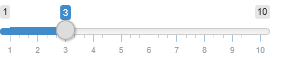
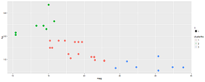

## Introduction

Sometimes picking the right car is not as easy as it seems. There is always a tradeoff between horsepower (hp) and miles per gallon (mpg)

This app separates available cars into groups from economical to wasteful. The number of groups can automaticall be specified by the user.

---

## There are just so many different cars available
```{r echo=FALSE, warning=FALSE}
library(ggplot2)
p = ggplot() +
    geom_point(data = mtcars, aes(x = mpg, y = hp)) +
    ggtitle("Plot of fuel consumption in cars")
```

```{r fig.align="center"}
print(p)
```

---
    
## Cars Clustering is easy

Just specify the amount of clusters you want to divide all available cars and the plot will automatically colour the dots into their respective group.

For example put the slider to three to select three clusters:



---

## Voila

The cars are clustered into three clusters:

Thank you for your attention & have fun!
wicht




